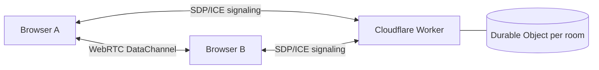

# EphemeralChat

EphemeralChat is a privacy-first, real-time 1-to-1 chat app built so conversations stay between peers. Messages travel directly over WebRTC DataChannels, and the server is used only for short-lived signaling during room setup.

There is no database, no message persistence, and no third-party chat backend relaying your conversation. That makes the app a good fit for private, temporary communication where you do not want chats stored, indexed, or replayed later.

## Why this exists

Most chat products optimize for retention, analytics, and long-term storage. EphemeralChat is built for the opposite use case: fast, disposable conversations with minimal surface area and no content history.

## Key features

- Peer-to-peer chat over WebRTC DataChannels
- Zero message persistence
- No database for chat content
- Short-lived signaling only for room negotiation
- One-click room creation and shareable room links
- Minimal UI focused on fast access and clarity
- Built with TypeScript for safer, maintainable code

## Privacy and security model

- Messages are not stored on a central server.
- The signaling server only exchanges SDP and ICE information needed to connect peers.
- Room traffic is not routed through a message relay once the data channel is established.
- The app avoids unnecessary third-party processing of chat content.

## Tech stack

- Frontend: Next.js 14, React 18, Tailwind CSS 3
- Signaling: Cloudflare Workers + Durable Objects
- Transport: WebRTC with STUN-only ICE in V1

## Repository structure

- `apps/web` - Next.js frontend
- `apps/signaling` - Cloudflare Worker signaling service
- `DEPLOYMENT.md` - production deployment guide

## Getting started locally

### Prerequisites

- Node.js 20+
- pnpm 8+

### Install dependencies

```bash
pnpm install
cp .env.example apps/web/.env.local
```

Make sure `apps/web/.env.local` contains:

```env
NEXT_PUBLIC_SIGNALING_URL=ws://localhost:8787
```

### Run the app

Start the signaling server:

```bash
pnpm dev:signaling
```

In a second terminal, start the web app:

```bash
pnpm dev:web
```

Then open the local app, create a room, copy the link, and open it in a second tab to test the full flow.

## Environment variables

| Variable                    | App | Description                                                                                                                     |
| --------------------------- | --- | ------------------------------------------------------------------------------------------------------------------------------- |
| `NEXT_PUBLIC_SIGNALING_URL` | web | WebSocket base URL for signaling, such as `ws://localhost:8787` in development or `wss://your-worker.workers.dev` in production |

## Scripts

| Command              | Description                                |
| -------------------- | ------------------------------------------ |
| `pnpm dev:web`       | Start the Next.js dev server               |
| `pnpm dev:signaling` | Start the Wrangler dev server              |
| `pnpm build`         | Build all packages                         |
| `pnpm typecheck`     | Run TypeScript checks across the workspace |
| `pnpm lint`          | Lint all packages                          |
| `pnpm test`          | Run unit tests                             |

## Deployment

See [DEPLOYMENT.md](DEPLOYMENT.md) for the full production deployment guide.

## Architecture



After the DataChannel opens, message bytes no longer pass through the server.

## Known limitations

- No TURN server, so some restrictive networks may fail to connect
- No reconnect after page refresh
- STUN-only ICE in V1

## License

Apache 2.0
